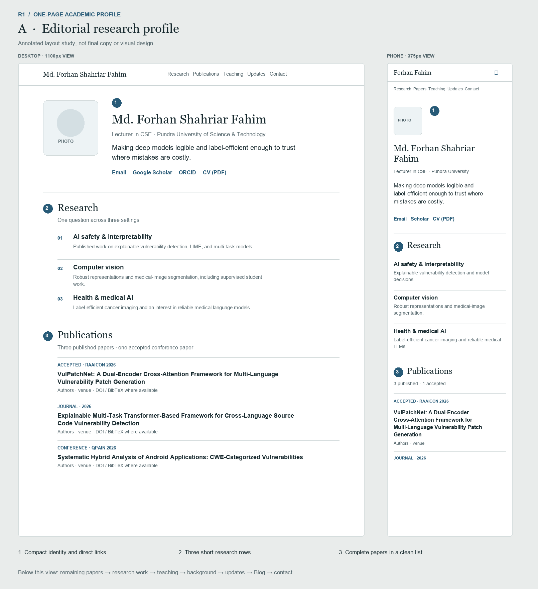
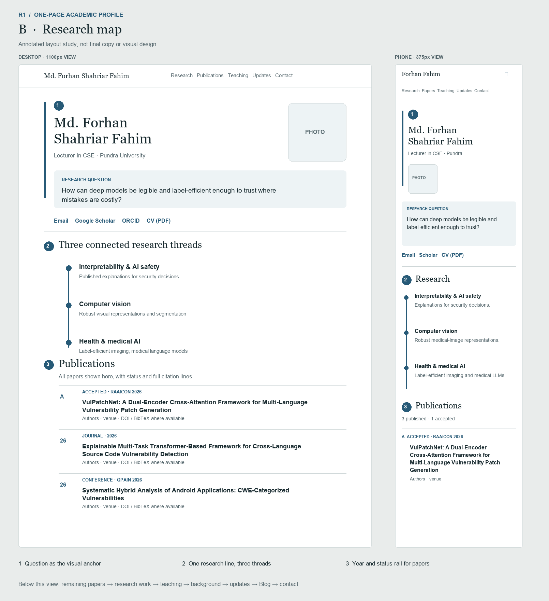

# R1: content inventory and wireframe review

**Status:** Approved, 26 September 2026. Forhan chose A's editorial structure
with B's restrained connection between the three research threads. The proposed
section order is accepted, skills stay in the PDF CV, and the full blog article
and PDF CV remain optional links. Read `ONE-PAGE-ROADMAP.md` for progress.

## Content inventory

`Keep` means the information is essential to the one-page academic profile.
`Condense` means retain the verified fact with less repeated prose. `Optional`
means it may be linked or included near the end. `Omit` means leave it out of
the one-page profile; this does not authorise deleting the current source page.
The source files remain canonical until their migration issues are completed.

| ID | Current content and source | Proposed destination | Treatment and verification |
|---|---|---|---|
| C01 | Name, photograph, Lecturer role, Pundra affiliation (`index.html`) | Identity | Keep. One `h1`; compact first screen. The portrait is an open taste decision. |
| C02 | Email, Scholar, ORCID, GitHub, LinkedIn (`index.html`) and PDF CV (`cv.html`) | Identity and Contact | Keep email, Scholar, and CV immediately visible. Keep ORCID, GitHub, and LinkedIn accessible as quieter links. No phone, home address, or referees' contacts. |
| C03 | About text, B.Sc., Fall 2027 application statement (`index.html`) | Short About within identity | Condense to two short paragraphs at most. Do not repeat the role at length. Keep the application statement factual. |
| C04 | Unifying question about legibility, label efficiency, and costly mistakes (`index.html`, `research.html`) | Identity lead and Research | Keep a brief lead in the first screen and a fuller explanation in Research. Preserve the link between the three threads. |
| C05 | AI safety and interpretability; published vulnerability-detection work using LIME, CWE categorisation, and multi-task transformers (`index.html`, `research.html`) | Research thread 1 | Keep. Show this as demonstrated work, with in-page links to the relevant papers. |
| C06 | Computer vision, medical image segmentation supervision, and interest in robust representations (`index.html`, `research.html`) | Research thread 2 | Keep, but distinguish current supervision and research interest from published results. |
| C07 | Health and medical AI, completed self-supervised cancer-imaging review, and interest in medical language models (`index.html`, `research.html`) | Research thread 3 | Keep. State that the review ran Aug 2025 to Sep 2026 and its manuscript remains in preparation. Medical LLMs are an interest, not completed work. |
| C08 | Three published 2026 papers with complete titles, author order, venue, DOI, and BibTeX (`publications.html`); summaries also in `index.html` and `cv.html` | Publications | Keep one complete visible list. Use `publications.html` for exact records during migration. DOI and BibTeX are optional actions on each record. |
| C09 | VulPatchNet, accepted at RAAICON 2026 (`publications.html`, `index.html`, `cv.html`) | Publications | Keep with a prominent **Accepted** status and no invented DOI, page range, or publication date. It concerns patch generation, not an explainability result. |
| C10 | Cancer-imaging review also listed as an in-preparation manuscript on `publications.html` and as research experience in `research.html` and `cv.html` | Research work | Keep once as a completed review with manuscript in preparation. Do not count it among published or accepted papers. |
| C11 | Force-invariant surface EMG undergraduate thesis, CNN–LSTM, 80% classification accuracy (`research.html`, `cv.html`) | Earlier research | Condense to a dated research entry. Check the exact performance wording against the current source before writing copy. |
| C12 | Current Algorithms and Machine Learning courses; previous Simulation and Modelling, Web Engineering, Structured Programming (`teaching.html`, `cv.html`) | Teaching | Keep current courses first. Condense past courses to a list; detailed course descriptions are optional. |
| C13 | 10+ undergraduate research students and brain tumour segmentation/detection topics (`teaching.html`, `cv.html`) | Teaching and supervision | Keep. Do not imply student work is the owner's publication. |
| C14 | Capstone supervision and full-stack project examples (`teaching.html`, `cv.html`) | Teaching, if space allows | Condense to one line about capstone supervision, without bringing web-development project examples to the main profile. |
| C15 | Lecturer appointment since Mar 2025 (`cv.html`, `teaching.html`, `index.html`) | Academic background | Keep dated entry; the first screen already gives the short role. Avoid repeating duties under both background and teaching. |
| C16 | B.Sc. CSE, University of Rajshahi, 2019–2024, CGPA 3.66/4.00, thesis (`cv.html`) | Academic background | Keep degree, institution, dates, and CGPA. The thesis belongs in Earlier research. Coursework and final-two-years CGPA can stay in the PDF CV. |
| C17 | Young Enthusiastic Faculty Member Award 2025 (`index.html`, `teaching.html`, `cv.html`) and Dean's Award 2023 (`cv.html`) | Recognition within background | Keep both briefly if the section remains compact. Do not duplicate the award wording in News and Background at full length. |
| C18 | Six dated news items (`index.html`) | Updates | Keep chronological list, with key 2026 paper news first. Consider a shorter initial view only if every essential paper is already visible above. Do not add a nested scrollbox. |
| C19 | One post dated 28 Aug 2026, "The Machine Learning Pipeline, and Where It Usually Breaks" (`blog.html`, `blog/ml-pipeline-common-mistakes.html`) | Blog preview after Updates | Keep title, date, one-sentence summary, and optional link to the full article. Do not embed the entire article in the academic profile. |
| C20 | Email and departmental location (`index.html`) | Contact | Keep email. Omit the postal-style location line in the proposed design; the affiliation is already visible above. |
| C21 | ML and programming skills (`cv.html`) | Optional compact line near Background | Decide in review. If included, prioritise research tools, not a large technology badge grid. |
| C22 | Web-development projects, competitive-programming ratings, references (`cv.html`) | PDF CV only | Omit from the one-page profile under the existing decision. |
| C23 | Research internship in the PDF CV and ended YOLO crop-disease project (`CONTEXT.md`, `AGENTS.md`) | Nowhere in HTML | Omit until the owner explicitly requests the internship; never present the YOLO project as current. |

### Repetition to remove during migration

- Publication records occur in three HTML files. The new homepage will hold
  one complete list and one structured-data list.
- The cancer-imaging review currently appears in About, Research, Publications,
  CV, and News. Its final placement is Research work, with only a brief cross
  reference in the Research narrative.
- Appointment and teaching duties repeat across About, Teaching, and CV. The
  identity states the role; Teaching lists courses and supervision; Academic
  background gives the date and institution.
- The 2025 faculty award appears in News, Teaching, and CV. Recognition carries
  the full fact; News can retain its dated announcement without extra detail.

## Proposed section names and copy budgets

Budgets guide drafting and can change after the wireframe review. They are for
prose only; exact publication metadata is never shortened to fit a budget.

| Section | Draft heading | Approximate prose budget | First design check |
|---|---|---:|---|
| Identity | Name, role, one-line question | 90–130 words | Research claim and CV/email/Scholar visible without scrolling at 1100px. |
| Research | Research | 45-word overview plus three 35–55-word threads | Published work, current work, and interests are distinguishable. |
| Publications | Publications | Intro under 20 words; four full records | All four records visible by scrolling, with title, authors, venue, and status. |
| Research work | Research work | Two entries of about 40–60 words | Review status and thesis dates are accurate. |
| Teaching | Teaching and supervision | 90–130 words | Current courses and 10+ supervised students scan quickly. |
| Background | Academic background | 70–110 words | Appointment, education, and awards fit without a second CV page. |
| Updates | Updates | Existing six short entries | Chronology is clear and links jump to records on the same page. |
| Blog | Blog | One 25–40-word teaser | Full article is clearly optional. |
| Contact | Contact | Under 35 words | Email is obvious; no personal address or phone. |

## Wireframe options

These are layout studies, not finished visual design and not a copy of either
reference. Both preserve the same academic information and place Publications
before general background. The accompanying images show desktop and a 375px
phone composition at approximately the same content depth. Long paper titles
are shortened in the images only to demonstrate line wrapping; the published
page must use the complete records in `publications.html`.

### A. Editorial research profile (recommended starting point)

- Compact portrait and identity in one row on desktop; a clean single column on
  phones. The research question is the strongest text after the name.
- Research threads read as three quiet, numbered rows. Publications follow
  promptly with full author and venue lines. Minimal rules, no card grid.
- Uses the current site's restraint while improving the order and scanning.

### B. Research map

- A compact research-question panel connects three strands before the papers.
  This is a more expressive identity without adopting Younus's particle field
  or Aritra's oversized headline.
- Publications use a thin year/status rail. It gives the page a recognisable
  rhythm but needs careful testing with long titles and on phones.
- Keep the visual device only if it clarifies the research narrative and the
  page remains as fast to scan as A.

## Choices for review

1. Which visual direction should R2 follow: A, B, or a specific combination?
   A is the recommendation because the papers and claims remain the focus.
2. Confirm the proposed order: Identity, Research, Publications, Research work,
   Teaching, Academic background, Updates, Blog, Contact. A change to the order
   should be made here before HTML migration.
3. Confirm whether the one-page profile should have a compact research-tools
   line. The default is to omit it and leave skills in the PDF CV.
4. Confirm that the full blog post and PDF CV remain optional links while their
   summaries and essential academic facts live on the homepage.

These choices were accepted on 26 September 2026 and recorded in `DECISIONS.md`.
R2 now implements section structure and navigation. This approval does not
publish the site.
